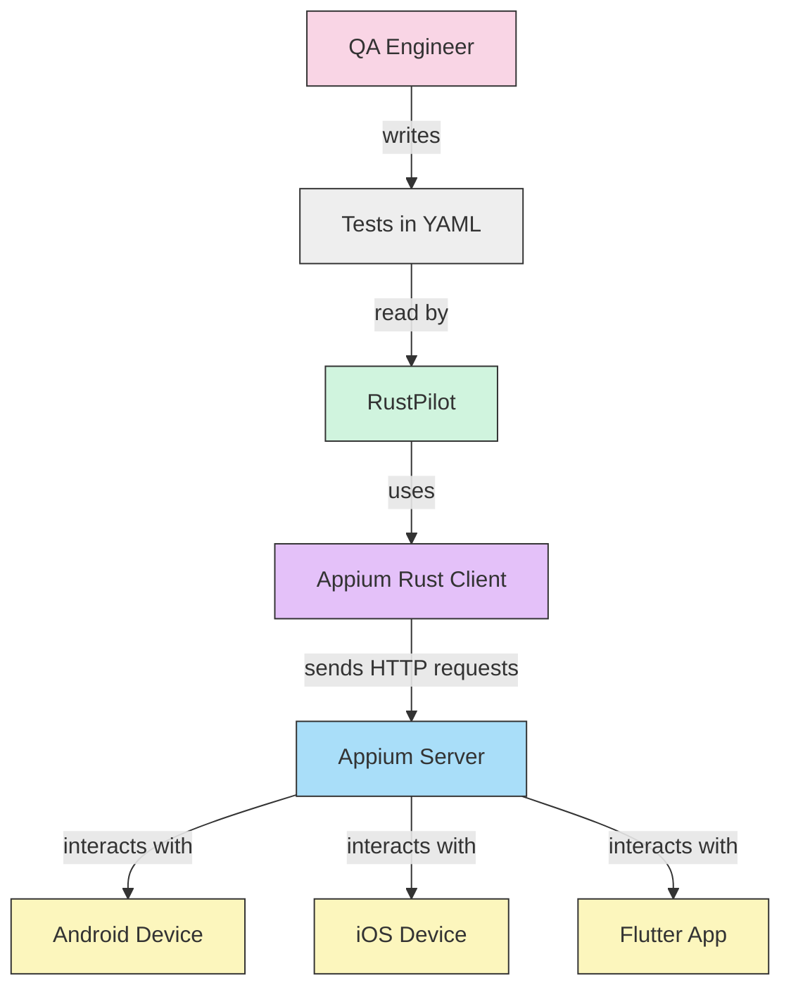

[](https://github.com/diegoQuinas/RustPilot/actions/workflows/rust-ci.yml)
[](https://codecov.io/gh/diegoQuinas/RustPilot)
[](https://crates.io/crates/rustpilot)
[](https://www.rust-lang.org)

# RustPilot

## What is RustPilot?

RustPilot is a powerful, fast, and reliable tool for automating mobile application testing. It supports Android, iOS, and Flutter applications with a simple YAML-based test definition format.

**Key Features:**
- Write tests in simple, readable YAML format
- Support for Android, iOS, and Flutter applications
- Fast execution with Rust's performance benefits
- Automatic test report generation
- Deterministic test results
- Compatible with Maestro-style test instructions


## How It Works

RustPilot acts as an intermediary between your test definitions and the Appium automation framework:



RustPilot reads your YAML test files (which are compatible with Maestro-style test instructions), processes them, and uses the Appium Rust client to communicate with the Appium server for executing test actions on your target devices.

## Example Test File

```yaml
appId: org.wikipedia
tags:
  - android
---
# Test steps
- runFlow: 'add-language.yml'      # Include another test file
- runFlow: 'remove-language.yml'    # Include another test file
- tapOn: 'CONTINUE'                # Tap on an element
- assertVisible: 'New ways to explore'  # Verify element is visible
- tapOn: 'CONTINUE'
- assertVisible: 'Reading lists with sync'
- tapOn: 'CONTINUE'
- assertVisible: 'Send anonymous data'
- tapOn: 'GET STARTED'
- runFlow: 'scroll-feed.yml'       # Run another test sequence
- runFlow: 'perform-search.yml'    # Run another test sequence
```

## Installation

### Prerequisites
- Rust and Cargo (latest stable version)
- Appium Server (for mobile device interaction)
- Android SDK or iOS development tools (depending on your testing targets)

### Steps

1. **Clone the repository:**
   ```bash
   git clone https://github.com/diegoQuinas/RustPilot.git
   cd RustPilot
   ```

2. **Build the project:**
   ```bash
   cargo build --release
   ```

## Usage

### Basic Usage

```bash
cargo run -- <capabilities_file.json> <test_file.yml>
```

### Capabilities File Example

```json
{
  "platformName": "Android",
  "appium:automationName": "UiAutomator2",
  "appium:deviceName": "Android Emulator",
  "appium:app": "/path/to/your/app.apk",
  "appium:noReset": true
}
```

## Test Reports

RustPilot automatically generates test reports after execution. Reports are saved in the `reports` directory and include:
- Test execution summary
- Steps executed
- Execution time
- Test details and results

## Contributing

Contributions are welcome! Feel free to:
- Report bugs
- Suggest new features
- Submit pull requests

Please follow Rust best practices when contributing code to maintain the project's modular, extensible, and readable structure.
